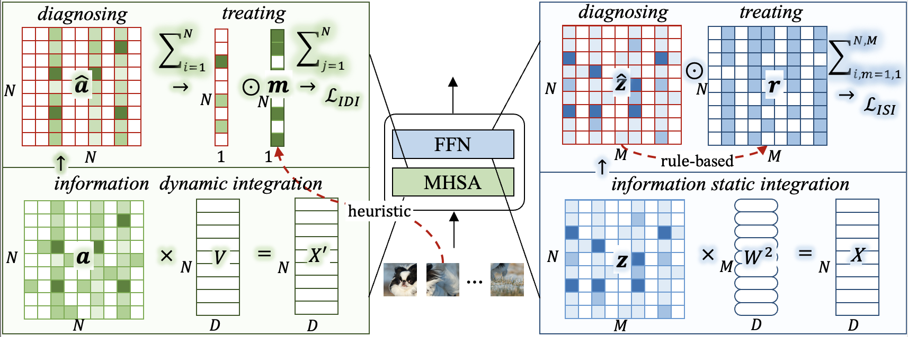

# Transformer Doctor: Diagnosing and Treating Vision Transformers



This repository contains the implementation for Transformer Doctor, a toolkit designed to diagnose and treat Transformer models for improved performance. Below are the details on setting up the environment and utilizing the provided scripts for training and refinement steps. For more information,
please visit https://transformer-doctor.github.io/.

## Environment Setup

- **GPU**: NVIDIA A6000
- **Python Environment**:
  - Python 3.9

## Key Steps

### 1. Training Baseline Model

To train a baseline model, execute the following command:

```bash
bash train.sh
```
### 2. Sifting High Confidence Samples
To obtain high-confidence samples based on the trained model, run:
```bash
bash sample_sift.sh
```
Key Parameter:

- is_high_confidence: Flag to filter high (1) or low (0) confidence samples

### 3. Static Integration Rules for Intra-Token Information
Compute static integration rules for intra-token information using:
```bash
bash grad_calculate.sh
```
Key Parameters:

- theta: Threshold value
- data_dir: Path to directory containing high-confidence samples

### 4. Treatment of Conjunction Errors in Dynamic Integration of Inter-Token Information
To treat conjunction errors in dynamic integration of inter-token information, execute:
```bash
bash train_att.sh
```
Key Parameters:

- origin_path: Path to the original model
- mask_path: Path to foreground annotation

### 5. Treatment of Conjunction Errors in Static Integration of Intra-Token Information
For treating conjunction errors in static integration of intra-token information, use:
```bash
bash train_grad.sh
```
Key Parameters:

- origin_path: Path to the original model
- grad_path: Path to static aggregation rules

## Further Steps
Following these key steps will aid in diagnosing and treating Transformer models using the Transformer Doctor toolkit. Stay tuned for more detailed code explanations and enhancements.


